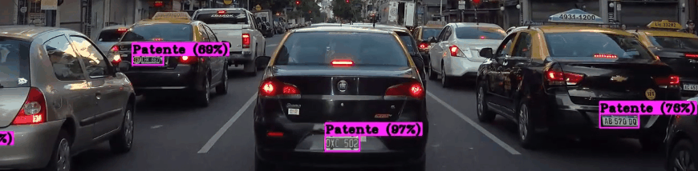
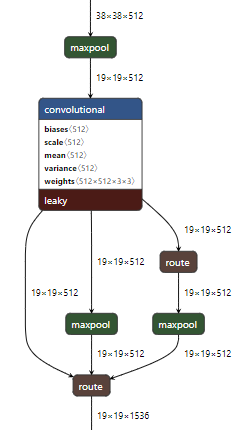

## 🔥 ¡NUEVO! Para una detección de patentes que usa YOLOv9, revisa el repo [open-image-models](https://github.com/ankandrew/open-image-models) con modelos entrenados con aún más datos. 🚀

# LocalizadorPatentes



## ¿Qué es YOLO?

YOLO v4 es un one-stage object detector (a diferencia de los two-stage, no tiene Region Proposal Networks). YOLO es rapido y preciso.
Por el entrenamiento de distintas escalas de imagenes (multi-scale training) se pueden usar los mismos weights/parametros aprendidos para imagenes de distintas resoluciones (No aplica a Yolo v4 tiny). Cabe rescatar que mayor la resolución, mayor el costo de computación (Cada filtro de la CNN tiene que hacer mas pasadas). 

[Aquí](#uso) se encuentran instrucciones de como utilizarlo.

## Video Demo

<a href="http://www.youtube.com/watch?feature=player_embedded&v=2GDMsFE_zKQ
" target="_blank"></a>

*Aclaracion: Este modulo es utilizado en [ConvALPR](https://github.com/ankandrew/ConvALPR)*

# Yolo v4

## Entrenamiento

Los modelos fueron entrenado con los siguientes datasets:
- [x] [OpenImages](https://storage.googleapis.com/openimages/web/download.html)
- [x] [Romanian Dataset of License Plates](https://github.com/RobertLucian/license-plate-dataset)
- [x] [OpenALPR benchmark dataset](https://github.com/openalpr/benchmarks)
- [ ] [CCPD Chinese City Parking Dataset, ECCV](https://github.com/detectRecog/CCPD)

*No se uso en ningun momento una patente vehicular de Argentina, aun asi no tiene problemas alguno en localizarlas*

## Yolo v4 (normal)

Los detalles de entramiento se encuentran en el yolov4_custom.cfg.
Se uso:
* Training con 448x448 (height,width)
* random=1 (multi-scale training)
* mosaic=1 (Mosaic Data Augmentation)


# Yolo v4 tiny(SPP)

Este modelo es mucho mas ligero que Yolo v4, ya que la cantidad de layers (por ende parametros) es menor. Este tipo de red es útil para dispositivos de placa reducida (ej [Jetson Nano](https://www.nvidia.com/en-us/autonomous-machines/embedded-systems/jetson-nano/)). Se uso el mismo dataset mencionado previamente

Se uso:
* mosaic=0 (Degrada la precisión en modelos chicos)
* Resolución de 608x608 (para detectar objetos chicos) 
* SPP


## ¿Qué es SPP?

**Spatial Pyramid Pooling** es un método de aumentar el receptive field del modelo (mayor recepción de pixeles), sin causar un notable costo extra de computación. Esto los autores de YOLO v4 lo implementan de la siguiente forma:



Recibe un volumen de 19x19x512 (*H,W,C*) y le aplica Max-Pooling con *filtros* de tamaño 5x5 y 3x3 (Usa padding para que *H* y *W* preserven el tamaño). Al resultado de estos dos volúmenes los concatena con el bloque original, formando un nuevo volumen de 19x19x1536

### Otros modelos

Ademas se encuentran variaciones de Yolo v4 Tiny con **diferentes resoluciones** de la imagen de entrada (608x608, 704x704, 832x832). Los que dicen custom_anchors, se le **calcularon** los anchors en base al dataset de patentes mencionado arriba.

# <a name="uso"></a> Como usar los modelos (Darknet)

Para **descargar, compilar y usar** YOLO v4 seguí el [tutorial oficial](https://github.com/AlexeyAB/darknet)

Para YOLO v4 hay que utilizar el [.cfg](yolo_v4_448x448/yolov4-custom.cfg) y .[weights](https://ufile.io/3fbpbqfh)

Si lo quieren correr en la **nube**: demo en [colab](https://colab.research.google.com/drive/12SimiWuyrB5hcxjJOJGTmxBblwI0-W5G?usp=sharing)

Para ejecutarlo localmente hay que descargarlo del repositorio [original](https://github.com/AlexeyAB/darknet). Luego se compila y para probarlo con un video: 

```
./darknet.exe detector demo obj.data yolov4-tiny-spp-608x608.cfg yolov4-tiny-spp-608x608_best.weights video_entrada.mkv -dont_show -out_filename video_salida.mkv
```

## Citas

```
@inproceedings{xu2018towards,
  title={Towards End-to-End License Plate Detection and Recognition: A Large Dataset and Baseline},
  author={Xu, Zhenbo and Yang, Wei and Meng, Ajin and Lu, Nanxue and Huang, Huan},
  booktitle={Proceedings of the European Conference on Computer Vision (ECCV)},
  pages={255--271},
  year={2018}
}
```
