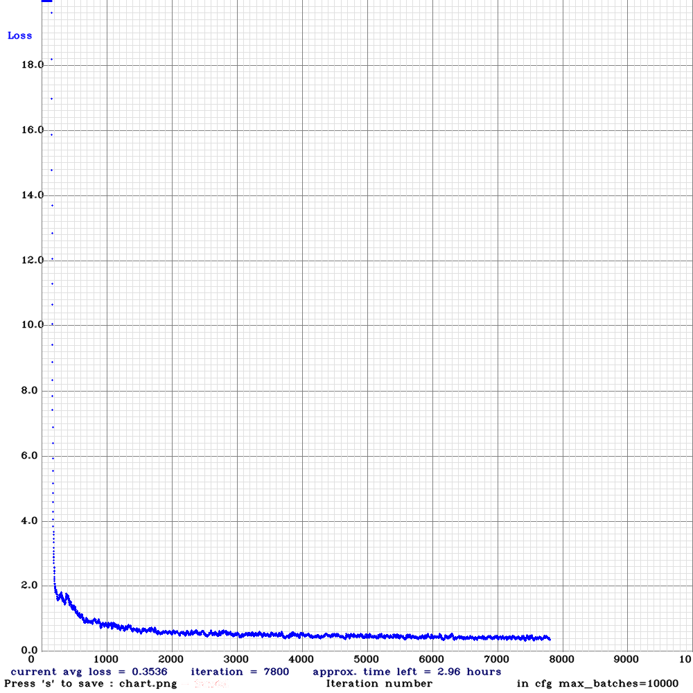
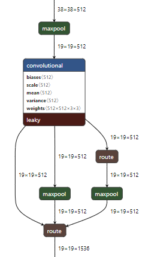
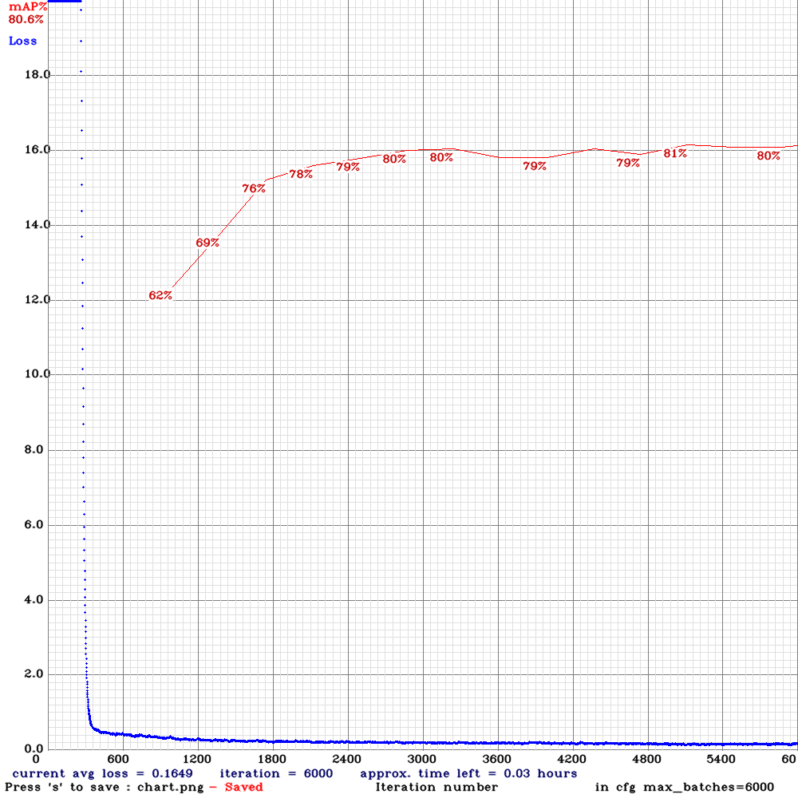

# LocalizadorPatentes

## ¿Qué es YOLO?

YOLO v4 es un one-stage object detector (a diferencia de los two-stage, no tiene Region Proposal Networks). YOLO es rapido y preciso.
Por el entrenamiento de distintas escalas de imagenes (multi-scale training) se pueden usar los mismos weights/parametros aprendidos para imagenes de distintas resoluciones. Cabe rescatar que mayor la resolución, mayor el costo de computación (Cada filtro de la CNN tiene que hacer mas pasadas). 

[Aquí](#uso) se encuentran instrucciones de como utilizarlo


Para saber como opera en general una ConvNet, sugiero el video:

<a href="http://www.youtube.com/watch?feature=player_embedded&v=3feOkIinEig
" target="_blank"></a>

# Yolo v4

## Entrenamiento

El modelo fue entrenado con los siguientes datasets:
- [x] [OpenImages](https://storage.googleapis.com/openimages/web/download.html)
- [x] [Romanian Dataset of License Plates](https://github.com/RobertLucian/license-plate-dataset)
- [x] [OpenALPR benchmark dataset](https://github.com/openalpr/benchmarks)
- [ ] [CCPD Chinese City Parking Dataset, ECCV](https://github.com/detectRecog/CCPD)

Los detalles de entramiento se encuentran en el yolov4_custom.cfg.
Se uso:
* Training con 448x448 (height,width)
* random=1 (multi-scale training)
* mosaic=1 (Mosaic Data Augmentation)

## Gráfico del entrenamiento


** No se muestra validation loss no se uso mientras se entrenaba. Se valido luego en dataset de prueba de OpenImages (VehiclePlates)

###### Resultados de la validación (448x448)

| Iteracion  | mAP |
| ----------- | ----------- |
| 1000  | 0.7763  |
| 2000  | 0.8487  |
| 3000  | 0.8699  |
| 4000  | 0.8701  |
| 5000  | 0.8714  |
| 6000  | **0.8760**  |
| 7000  | 0.8698  |
| 8000  | 0.8614  |

Luego de la 6000 iteración empiezar a decaer el performance ([over-fitting](https://en.wikipedia.org/wiki/Overfitting))

*Nota: El archivo .weights es del modelo correspondiente a la iteración 6000*

# Yolo v4 tiny(SPP)

Este modelo es mucho mas ligero que Yolo v4, ya que la cantidad de layers (por ende parametros) es menor. Este tipo de red es útil para dispositivos de placa reducida (ej [Jetson Nano](https://www.nvidia.com/en-us/autonomous-machines/embedded-systems/jetson-nano/)). Se uso el mismo dataset mencionado previamente

Se uso:
* mosaic=0 (Degrada la precisión en modelos chicos)
* Resolución de 608x608 (para detectar objetos chicos) 
* SPP


## ¿Qué es SPP?

Spatial Pyramid Pooling es un método de aumentar el receptive field del modelo (mayor recepción de pixeles), sin causar un notable costo extra de computación. Esto los autores de YOLO v4 lo implementan de la siguiente forma:



Recibe un volumen de 19x19x512 (*H,W,C*) y le aplica Max-Pooling con *filtros* de tamaño 5x5 y 3x3 (Usa padding para que *H* y *W* preserven el tamaño). Al resultado de estos dos volúmenes los concatena con el bloque original, formando un nuevo volumen de 19x19x1536

## Gráfico del entrenamiento



*Los parametros aprendidos corresponden al modelo con mayor mAp (en el dataset de validación)*

# <a name="uso"></a> Como usarlo

Para descargar, compilar y usar YOLO v4 seguí el [tutorial oficial](https://github.com/AlexeyAB/darknet)

Solo hay que utilizar el [.cfg](yolov4-custom.cfg) y .[weights](https://ufile.io/3fbpbqfh) provista en este repo.

Para Yolo v4 tiny es igual, pero con el .cfg y weights encontrados en la carpeta tiny_v4_spp_608x608

Si lo quieren correr en la nube: demo en [colab](https://colab.research.google.com/drive/12SimiWuyrB5hcxjJOJGTmxBblwI0-W5G?usp=sharing)

Para ejecutarlo localmente hay que descargarlo del repositorio [original](https://github.com/AlexeyAB/darknet). Luego se compila y para probarlo con un video: 

`./darknet.exe detector demo obj.data yolov4-tiny-spp-608x608.cfg yolov4-tiny-spp-608x608_best.weights video_entrada.mkv -dont_show -out_filename video_salida.mkv`

## Citas

```
@inproceedings{xu2018towards,
  title={Towards End-to-End License Plate Detection and Recognition: A Large Dataset and Baseline},
  author={Xu, Zhenbo and Yang, Wei and Meng, Ajin and Lu, Nanxue and Huang, Huan},
  booktitle={Proceedings of the European Conference on Computer Vision (ECCV)},
  pages={255--271},
  year={2018}
}
```
